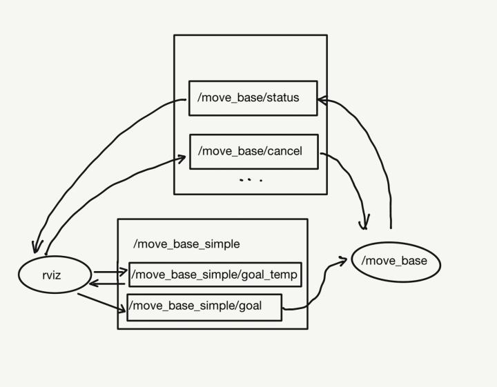

# 原始碼解析 | SLAM 多點導航開發思路介紹

### 開發背景：

在使用 ROS Navigation & RViz 進行 2D Nav Goal 導航的時候，我們會遇到這些情況：

1. 給定導航的目標點只能設定一個，當有多點任務時需要等待一個個任務結束後，再次手動給目標
2. 無法暫停或取消任務
3. 任務不可循環

### 開發目的：

完成多目標點導航，可以對導航環節進行操控，如可循環、取消、重設任務等。

### 開發思路：

1. 2D Nav Goal 的單點導航是如何實現的？

我們可以知道導航目標是通過 RViz 工具列中 2D Nav Goal發佈出去的。

通過查看 RViz的組態檔案或者 Panels->Add New Panel-> Tool Property ，可以瞭解當使用2D Nav Goal 在地圖上拉了一個箭頭（給定目標點時），其實是向話題 /move_base_simple/goal 發佈了 [geometry_msgs/PoseStamped](http://docs.ros.org/en/api/geometry_msgs/html/msg/PoseStamped.html) 類型的消息，這個是目標點的位姿，包含坐標點與朝向。

根據 NodeGraph 可以看到話題 /move_base_simple/goal 被導航包的節點 /move_base 訂閱了，進而發給 Navigation 中的各個話題，完成導航。


2. 如何基於單點實現多點導航？

要在單點基礎上實現多目標點導航的話，就要設計一個關於多個導航目標點消息geometry_msgs/PoseStamped的資料結構，並對多個目標點進行處理，完成導航。

實現多點的方法有多種，在不打破 ROS Navigation 包的完整性的前提下，我選擇在2D Nav Goal的 RViz節點和 /move_base 節點中間新增了一個話題 /move_base_simple/goal_temp，將原本傳送給 /move_base_simple/goal 的消息，轉發給/move_base_simple/goal_temp，通過此話題來積攢多個 2D Nav Goal（任務佇列），並根據任務完成的狀態反饋，按順序將每個導航目標點消息 geometry_msgs/PoseStamped 再傳送給話題/move_base_simple/goal，以完成多工中的單次目標點的導航（如下圖示）。



3. 如何來發佈多點任務？

像 2D Nav Goal 一樣，我們也可以在 RViz 中開發可視化的操作欄，這要使用到 RViz plugin ， ROS中的可視化工具絕大部分都是基於Qt進行開發的，此前古月居有過詳細介紹，可參考[這篇文章](https://zhuanlan.zhihu.com/p/39390512)。

### 最終效果

首先，我們來看一下最終的實現效果。

MultiNaviGoalsPanel是多點SLAM導航任務的可視化操作區，包括任務點列表、循環、重設、取消、開始任務。

通過 RViz plugin 設計的Mark Display，能夠顯示的目標點的標號及箭頭（朝向）。


### 原始碼

項目地址：https://github.com/autolaborcenter/rviz_navi_multi_goals_pub_plugin

#### 程式碼實現

#### 1. 標頭檔 multi_navi_goal_panel.h

Qt說明：

* 文字編輯——QLineEdit
* 按鍵——QPushButton
* 列表——QTableWidget
* 複選框——QCheckBox
* 文字顯示——QString

ROS說明:

Publisher：

* 傳送每個目標點消息給/move_base_simple/goal的goal_pub_
* 傳送取消指令消息給/move_base/cancel的cancel_pub_
* 傳送文字和箭頭標記的mark_pub_。

Subsrciber：

* 訂閱來自rviz中2D Nav Goal的導航目標點消息的goal_sub_
* 訂閱目前導航狀態的status_sub_

```
#ifndef MULTI_NAVI_GOAL_PANEL_H
#define MULTI_NAVI_GOAL_PANEL_H


#include <string>

#include <ros/ros.h>
#include <ros/console.h>

#include <rviz/panel.h>//plugin基類的標頭檔

#include <QPushButton>//Qt按鈕
#include <QTableWidget>//Qt表格
#include <QCheckBox>//Qt複選框

#include <visualization_msgs/Marker.h>
#include <geometry_msgs/PoseArray.h>
#include <geometry_msgs/Point.h>
#include <geometry_msgs/PoseStamped.h>
#include <std_msgs/String.h>
#include <actionlib_msgs/GoalStatus.h>
#include <actionlib_msgs/GoalStatusArray.h>
#include <tf/transform_datatypes.h>

namespace navi_multi_goals_pub_rviz_plugin {

    class MultiNaviGoalsPanel : public rviz::Panel {
    Q_OBJECT
    public:
        explicit MultiNaviGoalsPanel(QWidget *parent = 0);

    public Q_SLOTS:
        void setMaxNumGoal(const QString &maxNumGoal);//設定最大可設定的目標點數量
        void writePose(geometry_msgs::Pose pose);//將目標點位姿寫入任務列表
        void markPose(const geometry_msgs::PoseStamped::ConstPtr &pose);//在地圖中標記目標位姿
        void deleteMark();//刪除標記
    protected Q_SLOTS:

        void updateMaxNumGoal();             // 更新最大可設定的目標點數量
        void initPoseTable();               // 初始化目標點表格

        void updatePoseTable();             // 更新目標點表格
        void startNavi();                   // 開始第一個目標點任務導航
        void cancelNavi();                  // 取消現在進行中的導航

        void goalCntCB(const geometry_msgs::PoseStamped::ConstPtr &pose);  // 目標數量子回呼函數

        void statusCB(const actionlib_msgs::GoalStatusArray::ConstPtr &statuses); // 狀態子回呼函數

        void checkCycle();//確認循環

        void completeNavi();               // 第一個任務到達後，繼續進行剩下任務點的導航任務
        void cycleNavi();

        bool checkGoal(std::vector<actionlib_msgs::GoalStatus> status_list);  // 檢查是否到達目標點

        static void startSpin(); // 啟用ROS訂閱
    protected:
        QLineEdit *output_maxNumGoal_editor_;
        QPushButton *output_maxNumGoal_button_, *output_reset_button_, *output_startNavi_button_, *output_cancel_button_;
        QTableWidget *poseArray_table_;
        QCheckBox *cycle_checkbox_;

        QString output_maxNumGoal_;

        // The ROS node handle.
        ros::NodeHandle nh_;
        ros::Publisher goal_pub_, cancel_pub_, marker_pub_;
        ros::Subscriber goal_sub_, status_sub_;
        // 多目標點工作列定義
        int maxNumGoal_;
        int curGoalIdx_ = 0, cycleCnt_ = 0;
        bool permit_ = false, cycle_ = false, arrived_ = false;
        geometry_msgs::PoseArray pose_array_;

        actionlib_msgs::GoalID cur_goalid_;
    };

} // end namespace navi-multi-goals-pub-rviz-plugin

#endif // MULTI_NAVI_GOAL_PANEL_H
```

#### 2. cpp檔案 multi_navi_goal_panel.cpp

```
include <cstdio>

#include <ros/console.h>

#include <fstream>
#include <sstream>

#include <QPainter>
#include <QLineEdit>
#include <QVBoxLayout>
#include <QLabel>
#include <QTimer>
#include <QDebug>
#include <QtWidgets/QTableWidget>
#include <QtWidgets/qheaderview.h>


#include "multi_navi_goal_panel.h"

namespace navi_multi_goals_pub_rviz_plugin {


    MultiNaviGoalsPanel::MultiNaviGoalsPanel(QWidget *parent)
            : rviz::Panel(parent), nh_(), maxNumGoal_(1) {

        goal_sub_ = nh_.subscribe<geometry_msgs::PoseStamped>("move_base_simple/goal_temp", 1,
                                                              boost::bind(&MultiNaviGoalsPanel::goalCntCB, this, _1));

        status_sub_ = nh_.subscribe<actionlib_msgs::GoalStatusArray>("move_base/status", 1,
                                                                     boost::bind(&MultiNaviGoalsPanel::statusCB, this,
                                                                                 _1));

        goal_pub_ = nh_.advertise<geometry_msgs::PoseStamped>("move_base_simple/goal", 1);

        cancel_pub_ = nh_.advertise<actionlib_msgs::GoalID>("move_base/cancel", 1);

        marker_pub_ = nh_.advertise<visualization_msgs::Marker>("visualization_marker", 1);

        QVBoxLayout *root_layout = new QVBoxLayout;
        // create a panel about "maxNumGoal"
        QHBoxLayout *maxNumGoal_layout = new QHBoxLayout;
        maxNumGoal_layout->addWidget(new QLabel("Max Goals"));
        output_maxNumGoal_editor_ = new QLineEdit;
        maxNumGoal_layout->addWidget(output_maxNumGoal_editor_);
        output_maxNumGoal_button_ = new QPushButton("Confirm");
        maxNumGoal_layout->addWidget(output_maxNumGoal_button_);
        root_layout->addLayout(maxNumGoal_layout);

        cycle_checkbox_ = new QCheckBox("Loop");
        root_layout->addWidget(cycle_checkbox_);
        // creat a QTable to contain the poseArray
        poseArray_table_ = new QTableWidget;
        initPoseTable();
        root_layout->addWidget(poseArray_table_);
        //creat a manipulate layout
        QHBoxLayout *manipulate_layout = new QHBoxLayout;
        output_reset_button_ = new QPushButton("Reset");
        manipulate_layout->addWidget(output_reset_button_);
        output_cancel_button_ = new QPushButton("Cancel");
        manipulate_layout->addWidget(output_cancel_button_);
        output_startNavi_button_ = new QPushButton("Start Mission");
        manipulate_layout->addWidget(output_startNavi_button_);
        root_layout->addLayout(manipulate_layout);

        setLayout(root_layout);
        // set a Qtimer to start a spin for subscriptions
        QTimer *output_timer = new QTimer(this);
        output_timer->start(200);

        // 設定訊號與槽的連接
        connect(output_maxNumGoal_button_, SIGNAL(clicked()), this,
                SLOT(updateMaxNumGoal()));
        connect(output_maxNumGoal_button_, SIGNAL(clicked()), this,
                SLOT(updatePoseTable()));
        connect(output_reset_button_, SIGNAL(clicked()), this, SLOT(initPoseTable()));
        connect(output_cancel_button_, SIGNAL(clicked()), this, SLOT(cancelNavi()));
        connect(output_startNavi_button_, SIGNAL(clicked()), this, SLOT(startNavi()));
        connect(cycle_checkbox_, SIGNAL(clicked(bool)), this, SLOT(checkCycle()));
        connect(output_timer, SIGNAL(timeout()), this, SLOT(startSpin()));


    }

// 更新maxNumGoal命名
    void MultiNaviGoalsPanel::updateMaxNumGoal() {
        setMaxNumGoal(output_maxNumGoal_editor_->text());
    }

// set up the maximum number of goals
    void MultiNaviGoalsPanel::setMaxNumGoal(const QString &new_maxNumGoal) {
        // 檢查maxNumGoal是否發生改變.
        if (new_maxNumGoal != output_maxNumGoal_) {
            output_maxNumGoal_ = new_maxNumGoal;

            // 如果命名為空，不發佈任何資訊
            if (output_maxNumGoal_ == "") {
                nh_.setParam("maxNumGoal_", 1);
                maxNumGoal_ = 1;
            } else {
//                velocity_publisher_ = nh_.advertise<geometry_msgs::Twist>(output_maxNumGoal_.toStdString(), 1);
                nh_.setParam("maxNumGoal_", output_maxNumGoal_.toInt());
                maxNumGoal_ = output_maxNumGoal_.toInt();
            }
            Q_EMIT configChanged();
        }
    }

    // initialize the table of pose
    void MultiNaviGoalsPanel::initPoseTable() {
        ROS_INFO("Initialize");
        curGoalIdx_ = 0, cycleCnt_ = 0;
        permit_ = false, cycle_ = false;
        poseArray_table_->clear();
        pose_array_.poses.clear();
        deleteMark();
        poseArray_table_->setRowCount(maxNumGoal_);
        poseArray_table_->setColumnCount(3);
        poseArray_table_->setEditTriggers(QAbstractItemView::NoEditTriggers);
        poseArray_table_->horizontalHeader()->setSectionResizeMode(QHeaderView::Stretch);
        QStringList pose_header;
        pose_header << "x" << "y" << "yaw";
        poseArray_table_->setHorizontalHeaderLabels(pose_header);
        cycle_checkbox_->setCheckState(Qt::Unchecked);

    }

    // delete marks in the map
    void MultiNaviGoalsPanel::deleteMark() {
        visualization_msgs::Marker marker_delete;
        marker_delete.action = visualization_msgs::Marker::DELETEALL;
        marker_pub_.publish(marker_delete);
    }

    //update the table of pose
    void MultiNaviGoalsPanel::updatePoseTable() {
        poseArray_table_->setRowCount(maxNumGoal_);
//        pose_array_.poses.resize(maxNumGoal_);
        QStringList pose_header;
        pose_header << "x" << "y" << "yaw";
        poseArray_table_->setHorizontalHeaderLabels(pose_header);
        poseArray_table_->show();
    }

    // call back function for counting goals
    void MultiNaviGoalsPanel::goalCntCB(const geometry_msgs::PoseStamped::ConstPtr &pose) {
        if (pose_array_.poses.size() < maxNumGoal_) {
            pose_array_.poses.push_back(pose->pose);
            pose_array_.header.frame_id = pose->header.frame_id;
            writePose(pose->pose);
            markPose(pose);
        } else {
            ROS_ERROR("Beyond the maximum number of goals: %d", maxNumGoal_);
        }
    }

    // write the poses into the table
    void MultiNaviGoalsPanel::writePose(geometry_msgs::Pose pose) {

        poseArray_table_->setItem(pose_array_.poses.size() - 1, 0,
                                  new QTableWidgetItem(QString::number(pose.position.x, 'f', 2)));
        poseArray_table_->setItem(pose_array_.poses.size() - 1, 1,
                                  new QTableWidgetItem(QString::number(pose.position.y, 'f', 2)));
        poseArray_table_->setItem(pose_array_.poses.size() - 1, 2,
                                  new QTableWidgetItem(
                                          QString::number(tf::getYaw(pose.orientation) * 180.0 / 3.14, 'f', 2)));

    }

    // when setting a Navi Goal, it will set a mark on the map
    void MultiNaviGoalsPanel::markPose(const geometry_msgs::PoseStamped::ConstPtr &pose) {
        if (ros::ok()) {
            visualization_msgs::Marker arrow;
            visualization_msgs::Marker number;
            arrow.header.frame_id = number.header.frame_id = pose->header.frame_id;
            arrow.ns = "navi_point_arrow";
            number.ns = "navi_point_number";
            arrow.action = number.action = visualization_msgs::Marker::ADD;
            arrow.type = visualization_msgs::Marker::ARROW;
            number.type = visualization_msgs::Marker::TEXT_VIEW_FACING;
            arrow.pose = number.pose = pose->pose;
            number.pose.position.z += 1.0;
            arrow.scale.x = 1.0;
            arrow.scale.y = 0.2;
            number.scale.z = 1.0;
            arrow.color.r = number.color.r = 1.0f;
            arrow.color.g = number.color.g = 0.98f;
            arrow.color.b = number.color.b = 0.80f;
            arrow.color.a = number.color.a = 1.0;
            arrow.id = number.id = pose_array_.poses.size();
            number.text = std::to_string(pose_array_.poses.size());
            marker_pub_.publish(arrow);
            marker_pub_.publish(number);
        }
    }

    // check whether it is in the cycling situation
    void MultiNaviGoalsPanel::checkCycle() {
        cycle_ = cycle_checkbox_->isChecked();
    }

    // start to navigate, and only command the first goal
    void MultiNaviGoalsPanel::startNavi() {
        curGoalIdx_ = curGoalIdx_ % pose_array_.poses.size();
        if (!pose_array_.poses.empty() && curGoalIdx_ < maxNumGoal_) {
            geometry_msgs::PoseStamped goal;
            goal.header = pose_array_.header;
            goal.pose = pose_array_.poses.at(curGoalIdx_);
            goal_pub_.publish(goal);
            ROS_INFO("Navi to the Goal%d", curGoalIdx_ + 1);
            poseArray_table_->item(curGoalIdx_, 0)->setBackgroundColor(QColor(255, 69, 0));
            poseArray_table_->item(curGoalIdx_, 1)->setBackgroundColor(QColor(255, 69, 0));
            poseArray_table_->item(curGoalIdx_, 2)->setBackgroundColor(QColor(255, 69, 0));
            curGoalIdx_ += 1;
            permit_ = true;
        } else {
            ROS_ERROR("Something Wrong");
        }
    }

    // complete the remaining goals
    void MultiNaviGoalsPanel::completeNavi() {
        if (curGoalIdx_ < pose_array_.poses.size()) {
            geometry_msgs::PoseStamped goal;
            goal.header = pose_array_.header;
            goal.pose = pose_array_.poses.at(curGoalIdx_);
            goal_pub_.publish(goal);
            ROS_INFO("Navi to the Goal%d", curGoalIdx_ + 1);
            poseArray_table_->item(curGoalIdx_, 0)->setBackgroundColor(QColor(255, 69, 0));
            poseArray_table_->item(curGoalIdx_, 1)->setBackgroundColor(QColor(255, 69, 0));
            poseArray_table_->item(curGoalIdx_, 2)->setBackgroundColor(QColor(255, 69, 0));
            curGoalIdx_ += 1;
            permit_ = true;
        } else {
            ROS_ERROR("All goals are completed");
            permit_ = false;
        }
    }

    // command the goals cyclically
    void MultiNaviGoalsPanel::cycleNavi() {
        if (permit_) {
            geometry_msgs::PoseStamped goal;
            goal.header = pose_array_.header;
            goal.pose = pose_array_.poses.at(curGoalIdx_ % pose_array_.poses.size());
            goal_pub_.publish(goal);
            ROS_INFO("Navi to the Goal%lu, in the %dth cycle", curGoalIdx_ % pose_array_.poses.size() + 1,
                     cycleCnt_ + 1);
            bool even = ((cycleCnt_ + 1) % 2 != 0);
            QColor color_table;
            if (even) color_table = QColor(255, 69, 0); else color_table = QColor(100, 149, 237);
            poseArray_table_->item(curGoalIdx_ % pose_array_.poses.size(), 0)->setBackgroundColor(color_table);
            poseArray_table_->item(curGoalIdx_ % pose_array_.poses.size(), 1)->setBackgroundColor(color_table);
            poseArray_table_->item(curGoalIdx_ % pose_array_.poses.size(), 2)->setBackgroundColor(color_table);
            curGoalIdx_ += 1;
            cycleCnt_ = curGoalIdx_ / pose_array_.poses.size();
        }
    }

    // cancel the current command
    void MultiNaviGoalsPanel::cancelNavi() {
        if (!cur_goalid_.id.empty()) {
            cancel_pub_.publish(cur_goalid_);
            ROS_ERROR("Navigation have been canceled");
        }
    }

    // call back for listening current state
    void MultiNaviGoalsPanel::statusCB(const actionlib_msgs::GoalStatusArray::ConstPtr &statuses) {
        bool arrived_pre = arrived_;
        arrived_ = checkGoal(statuses->status_list);
        if (arrived_) { ROS_ERROR("%d,%d", int(arrived_), int(arrived_pre)); }
        if (arrived_ && arrived_ != arrived_pre && ros::ok() && permit_) {
            if (cycle_) cycleNavi();
            else completeNavi();
        }
    }

    //check the current state of goal
    bool MultiNaviGoalsPanel::checkGoal(std::vector<actionlib_msgs::GoalStatus> status_list) {
        bool done;
        if (!status_list.empty()) {
            for (auto &i : status_list) {
                if (i.status == 3) {
                    done = true;
                    ROS_INFO("completed Goal%d", curGoalIdx_);
                } else if (i.status == 4) {
                    ROS_ERROR("Goal%d is Invalid, Navi to Next Goal%d", curGoalIdx_, curGoalIdx_ + 1);
                    return true;
                } else if (i.status == 0) {
                    done = true;
                } else if (i.status == 1) {
                    cur_goalid_ = i.goal_id;
                    done = false;
                } else done = false;
            }
        } else {
            ROS_INFO("Please input the Navi Goal");
            done = false;
        }
        return done;
    }

// spin for subscribing
    void MultiNaviGoalsPanel::startSpin() {
        if (ros::ok()) {
            ros::spinOnce();
        }
    }

} // end namespace navi-multi-goals-pub-rviz-plugin

// 聲明此類是一個rviz的外掛

#include <pluginlib/class_list_macros.h>

PLUGINLIB_EXPORT_CLASS(navi_multi_goals_pub_rviz_plugin::MultiNaviGoalsPanel, rviz::Panel)

```

### 使用

使用請參考[使用說明](README.md)。
