# [筆記] Rviz 多點導航插件

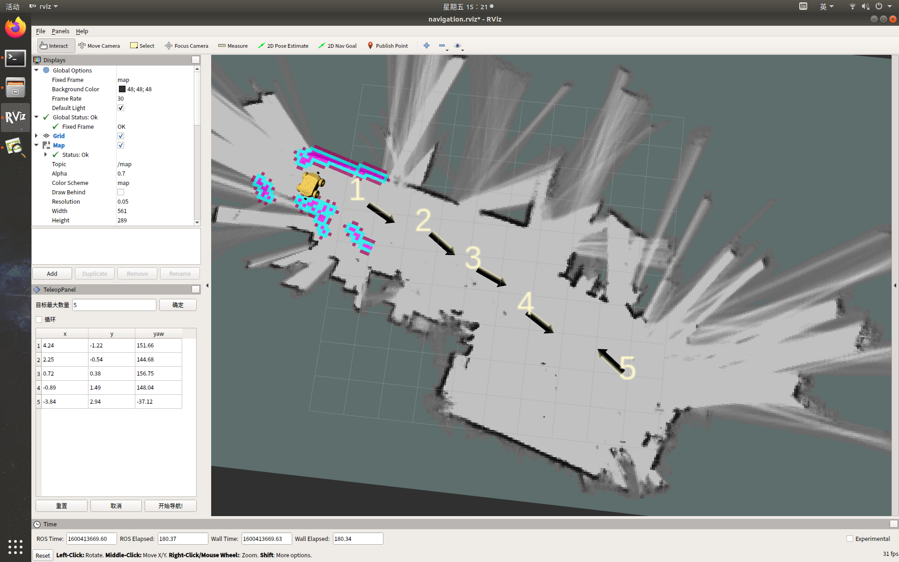

## 1. 安裝

1. 下載檔案
  進入到機器人工作目錄的 /src 目錄中，並執行以下指令來下載插件
    ```
    git clone https://github.com/EnderDragonEP/Multi_Goals_Navi_Plugin-Fork.git
    ```

  **註：要求提前建好地圖**
  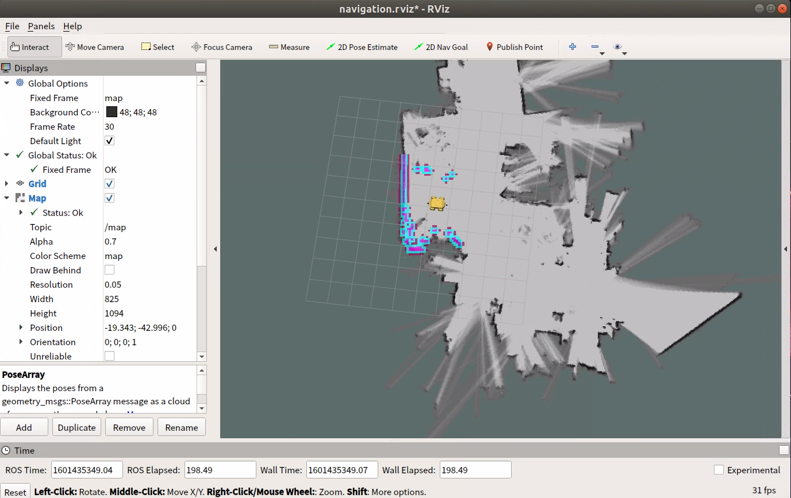

2. 載入外掛

    RViz 的左上角依次點選 Panels → Add New Panel → navi_multi_goals_pub_rviz_plugin → MultiNaviGoalsPanel

    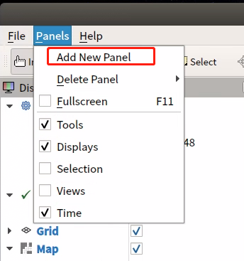

    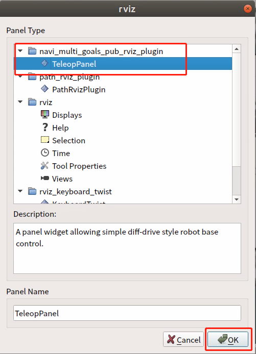

**插件視窗：**
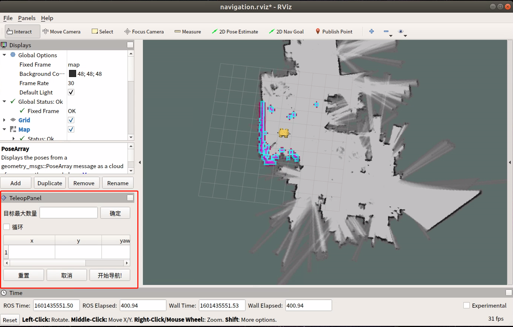

3. 修改組態
    * 新增 marker （目標點標記）
    
        RViz 左側 Display → add → Marker

        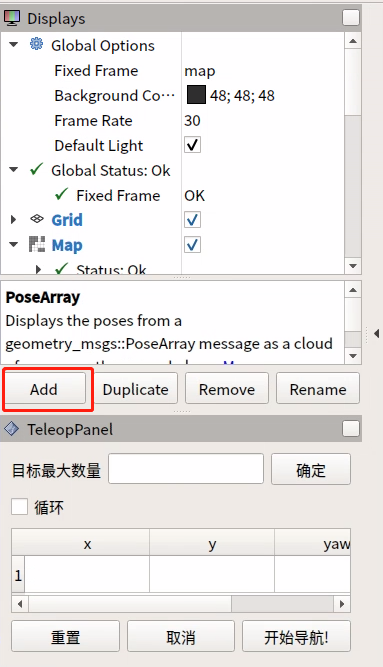

        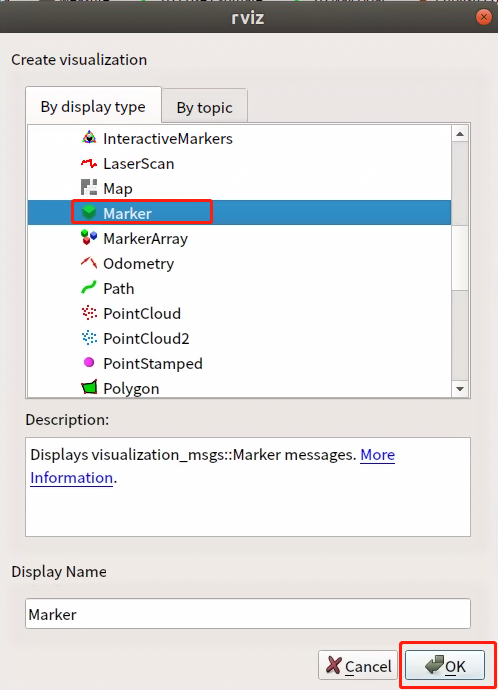
        
  * 修改 2D Nav Goal 按鈕話題
    * RViz 的左上角 Panels → Add New Panel → Tool Property

    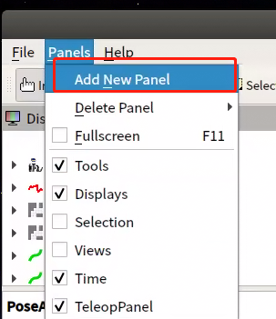

        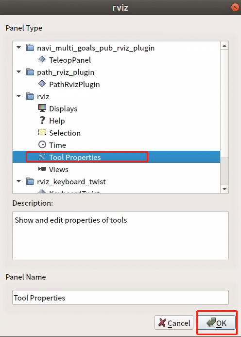

    * 將 2D Nav Goal → Topic 修改為 /move_base_simple/goal_temp
    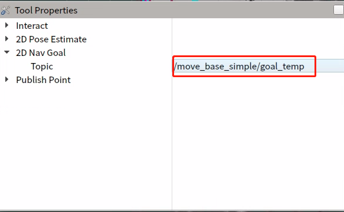

**做完以上操作後 Ctrl  + S 保存 RViz 組態，如忘記保存，則下次進來要重複操作。**

## 2. 使用說明
1. 可設定目標點的最大數量：要求所設定目標點個數不能大於該參數（可以小於）
2. 是否循環：若勾選，導航至最後一個目標點後，將重新導航至第一個目標點。例：1 → 2 → 3 → 1 → 2 → 3 → ···，該選項必須在開始導航前勾選
3. 任務目標點列表： x/y/yaw，地圖上給定目標點的位姿（xy坐標與航向角yaw)。

   * 設定完目標最大數量，保存後，該列表會生成對應數量的條目
   * 每給出一個目標點，此處會讀取到目標點的坐標與朝向
4. 重設：將清空當前所有目標點
5. 取消：取消當前目標點導航任務，機器人停止運動。再次點選開始導航後，會從下一個任務點開始。

   * 例：1→2→3，在1→2的過程中點選取消，機器人停止運動，點選開始導航後，機器人將從當前坐標點去往3。
6. 開始導航：開始任務

## 3. 操作步驟說明
* 初始化機器人位置

  * 點選開始導航，打開 rviz，使用鍵盤控制機器人運動，當環境特徵與地圖匹配完成後，機器人會定位到地圖中對應的位置。
* 設定任務

  * 設定任務目標點個數，點選確認保存
    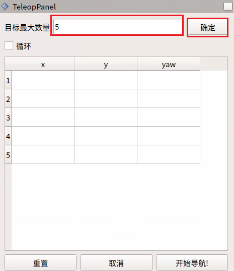

  * 設定目標點
    點選ToolBar上的2D Nav Goal，在地圖上給定目標點。（每次設定都需要先點選2D Nav Goal）
    目標點有朝向區分，箭頭頂端為車頭方向。
    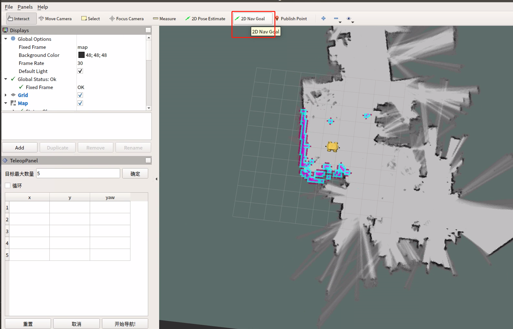

* 點選開始導航，導航開始
  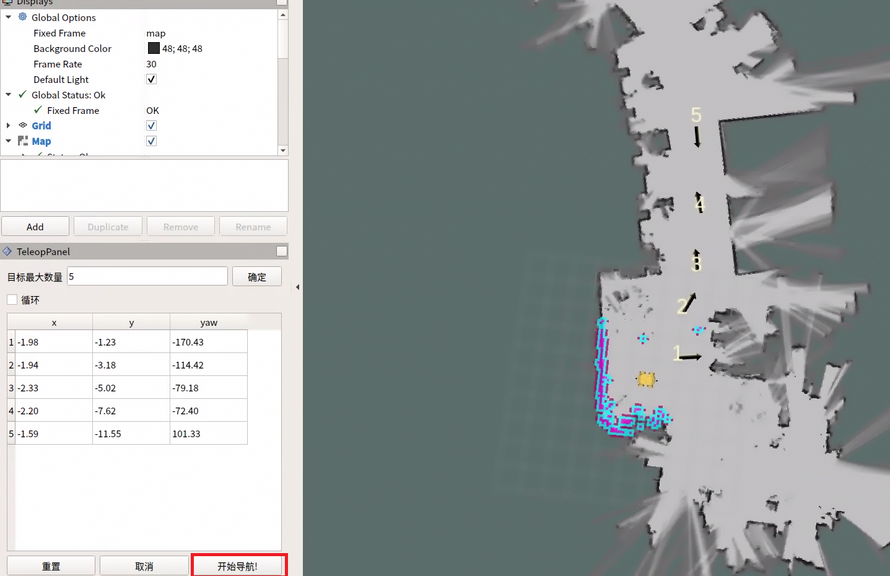

  已完成任務會變為紅色（如下圖）
  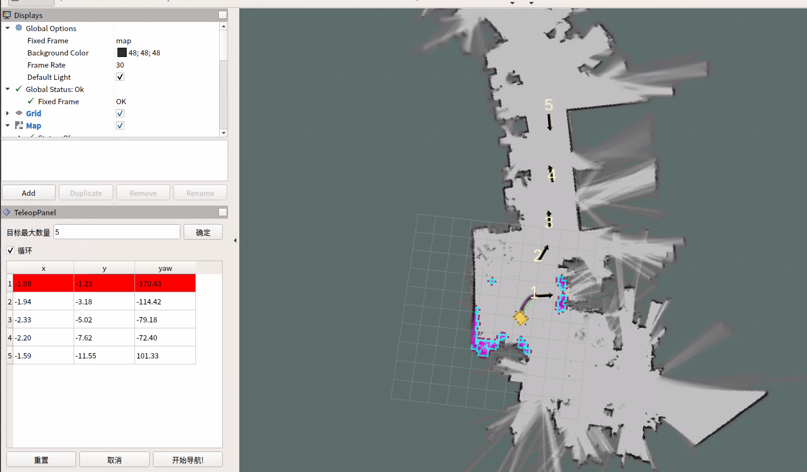

  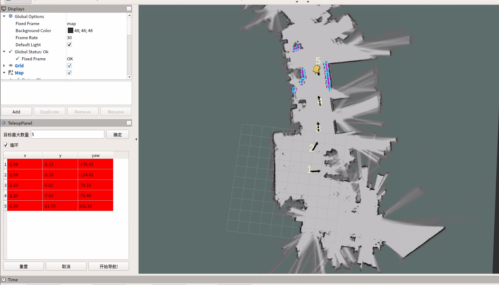

  未勾選循環，單次任務完成後停止。
  勾選循環，單次任務完成後，會從最後一個目標點到第一個目標點，顯示顏色為藍色。
  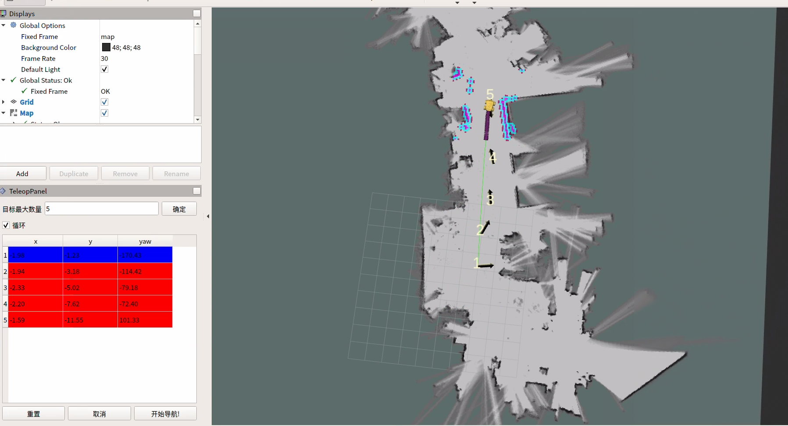
