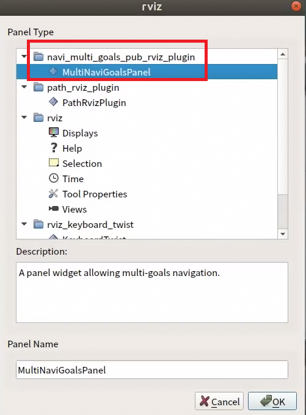
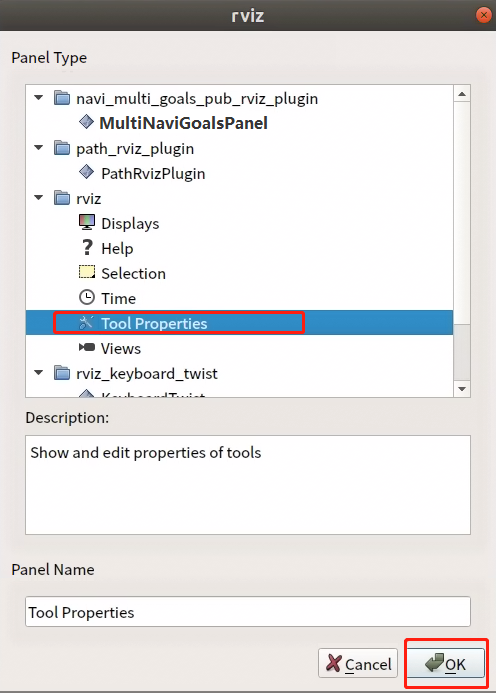
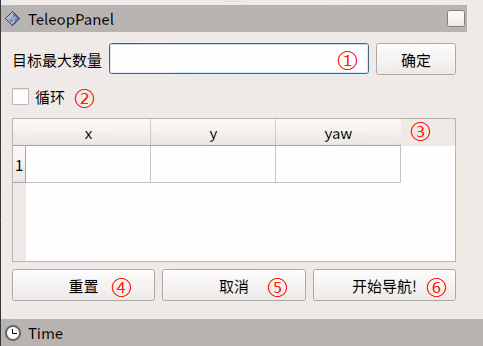

#  SLAM 多點導航功能包

## navi_multi_goals_pub_rviz_plugin


### 描述：

該功能包為SLAM 建圖導航提供可發佈多個目標點任務的導航方式。

### 要求:

必須基於 Autolabor SLAM導航使用


### 一、安裝與組態


#### 1. 下載程序包

進入 /home/autolabor/catkin_ws/src 目錄，執行

```
git clone https://github.com/autolaborcenter/rviz_navi_multi_goals_pub_plugin.git
```

或訪問 https://github.com/autolaborcenter/rviz_navi_multi_goals_pub_plugin.git 下載原始碼，放入 /home/autolabor/catkin_ws/src 目錄中


給新加入的檔案新增操作權限，在/home/autolabor/catkin_ws 目錄下，右鍵打開終端，執行

`sudo chmod -R 777 /home/autolabor/catkin_ws/src/`

輸入密碼 `autolabor`，Enter

#### 2. 編譯

還是在 /home/autolabor/catkin_ws 目錄下，終端執行

`sudo rm -rf build/ devel/ logs/ .catkin_tools/`

輸入密碼 `autolabor`，Enter，然後執行

`catkin build`

#### 3. 編譯完成後，啟動【開始導航】

**註：要求提前建好地圖。**


#### 4. 載入外掛

RViz 的左上角依次點選 Panels -> Add New Panel -> navi_multi_goals_pub_rviz_plugin -> MultiNaviGoalsPanel 



<div style="clear: both;"></div>

***

**載入完畢：**


#### 5. 修改組態

##### 1) 新增 marker （目標點標記）

RViz 左側 Display -> add -> Marker


<div style="clear: both;"></div>

***

##### 2) 修改 2D Nav Goal 按鈕話題

RViz 的左上角 Panels->Add New Panel-> Tool Property

將 2D Nav Goal -> Topic 修改為 /move_base_simple/goal_temp 



<div style="clear: both;"></div>


***

**做完以上操作後 Ctrl  + S 保存 RViz 組態，如忘記保存，則下次進來要重複操作。**


### 二、使用

### 操作區說明



① 可設定目標點的最大數量：要求所設定目標點個數不能大於該參數（可以小於）

② 是否循環：若勾選，導航至最後一個目標點後，將重新導航至第一個目標點。例：1->2->3->1->2->3->···，該選項必須在開始導航前勾選

③ 任務目標點列表： x/y/yaw，地圖上給定目標點的位姿（xy坐標與航向角yaw)。

* 設定完目標最大數量，保存後，該列表會生成對應數量的條目
* 每給出一個目標點，此處會讀取到目標點的坐標與朝向

④ 重設：將清空當前所有目標點

⑤ 取消：取消當前目標點導航任務，機器人停止運動。再次點選開始導航後，會從下一個任務點開始。

例：1->2->3，在1->2的過程中點選取消，機器人停止運動，點選開始導航後，機器人將從當前坐標點去往3。

⑥ 開始導航：開始任務

### 操作步驟說明

#### 1. 初始化機器人位置

點選開始導航，打開 rviz，使用鍵盤控制機器人運動，當環境特徵與地圖匹配完成後，機器人會定位到地圖中對應的位置。

#### 2. 設定任務

##### 1) 設定任務目標點個數，點選確認保存


##### 2) 設定目標點

點選ToolBar上的2D Nav Goal，在地圖上給定目標點。（每次設定都需要先點選2D Nav Goal）

目標點有朝向區分，箭頭頂端為車頭方向。


##### 3) 點選開始導航，導航開始


已完成任務會變為紅色（如下圖）


未勾選循環，單次任務完成後停止。

勾選循環，單次任務完成後，會從最後一個目標點到第一個目標點，顯示顏色為藍色。


